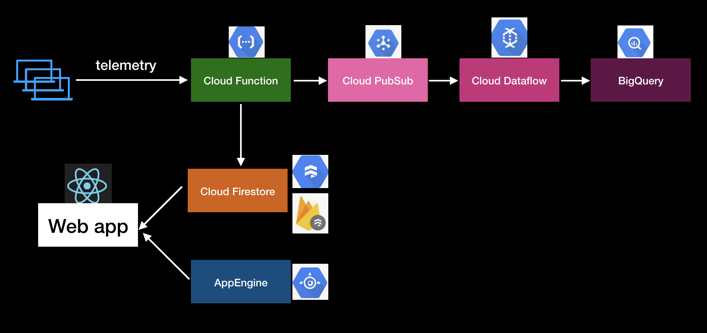
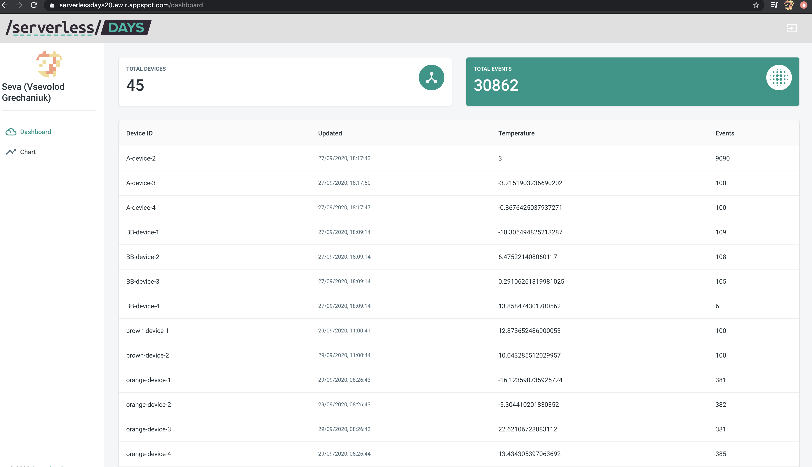
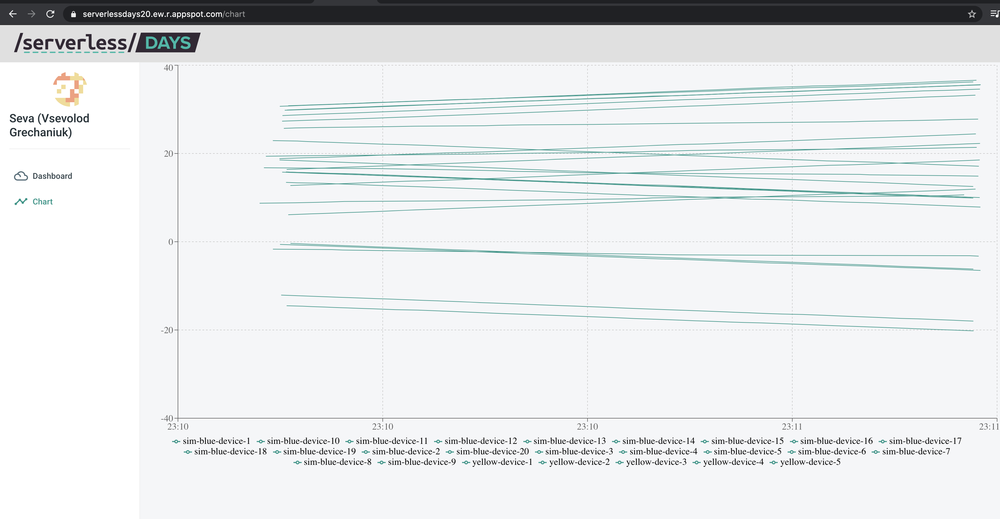

# ServerlessDays 2020 Hamburg
GCP workshop source code





### simulation

- create vm
- ssh to vm
```bash
gcloud beta compute ssh --zone "us-central1-a" "instance-1" --project "serverlessdays20"
```
- install dependencies
```bash
sudo apt install git
sudo apt install python3
git clone https://github.com/redvg/serverlessdays20
cd serverlessdays20
cd simulation
sudo apt install python3-pip
pip3 install -v requests
pip3 install aiohttp
```
- run simulation
```bash
chmod +x ./run.sh
./run.sh {SIMULATION_ID} {NUMBER_OF_DEVICES} {NUMBER_OF_SIGNALS_FROM_DEVICE} {ENDPOINT}
```
or
```bash
python3 simulate.py --endpoint=https://europe-west1-serverlessdays20.cloudfunctions.net/consumer --simulation_id=green --number_of_devices=4  --number_of_signals=100
```

### cloud function

- create with http trigger
- use main.py & requirements.txt 


### firestore

- enable firestore in native mode
- create `events` collection

### 


webapp
cd webapp
npm i
npm start

https://material-ui.com/ru/

firebase:
add sdk
firebase utils js
auth: enable google signin, add auth domain

dashboard.js - stream
chart.js - stream + change type


gae
cd appengine
make build
dockerfile
expose 5050

cloud shell
git clone https://github.com/redvg/serverlessdays20
cd app
gcloud app deploy
domain .....appspot -> firebase auth add to authd domains


bq
create dataset
create table!
create gcs bucket
create dataflow from template topic to bq

https://cloud.google.com/dataflow/docs/guides/templates/provided-templates
https://cloud.google.com/dataflow/docs/guides/templates/provided-streaming#cloudpubsubtobigquery
https://github.com/GoogleCloudPlatform/DataflowTemplates/blob/master/src/main/java/com/google/cloud/teleport/templates/PubSubToBigQuery.java